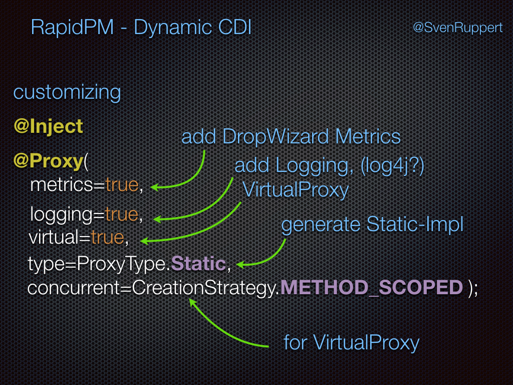

# Injections 

Here I will explain the different ways to resolve what is the right implementation. This will ledd at some points 
to other chapters here at this website for more or detailed informations about the way it is realized.

But lets start with the Hello World.


## How DDI will resolve the corresponding Implementation?

Please, check the description of a ***[ClassResolver](http://www.dynamic-dependency-injection.org/resolver/)*** 
and ***[ProducerResolver](http://www.dynamic-dependency-injection.org/resolver/)***

Here I will give you the full list of all combinations you could use with this Dynamic-Dependency Injection Framework.
This will help you to decide what kind of combinations are fitting best for you inside your project.
One thing that I could recommend to think about is, the way you want to write injected Mocks.

### ``@Inject Interface``
If you write ``@Inject Interface`` the framework will use the following to resolv the corresponding implementation.

* Interface , no Impl. -> ***Exception***
* Interface , no Impl., 1 Producer for the Interface  -> Producer for the Interface will be used

* Interface , 1 Impl. -> will use the Impl.
* Interface , 1 Impl., 1 Producer for Impl. -> Producer for the Impl will be used
* Interface , 1 Impl., n Producer for Impl. -> ***Exception***
* Interface , 1 Impl., 1 Producer for Interface -> Producer for the Interface will be used
* Interface , 1 Impl., n Producer for Interface -> ***Exception***

* Interface , 1 Impl., 1 Producer for Interface , 1 Producer for Impl. -> ***Exception***

* Interface , n Impl. -> ***Exception***
* Interface , n Impl., 1 responsible ClassResolver -> result of the ClassResolver will be used
* Interface , n Impl., 1 Producer for Interface -> Producer for the Interface will be used
* Interface , n Impl., 1-n Producer for Impl. -> ***Exception***

* Interface , n Impl., 1 responsible ClassResolver, 1 Producer for Interface -> Producer for the Interface will be used
* Interface , n Impl., 1 responsible ClassResolver, 1-n Producer for Impl. -> will use the resolved Class or corresponding Producer if available
* Interface , n Impl., n responsible ClassResolver -> ***Exception***

* Interface, 1 Impl., n Producer for Impl, 1 ProducerResolver for Impl -> selected Producer from ProducerResolver
* Interface, n Impl., 1 responsible ClassResolver, 0-n Producer for every Impl, 1 ProducerResolver for every Impl -> selected Producer from ProducerResolver, for selected Impl from ClassResolver

###``@Inject Impl.``
If you write ``@Inject Impl.`` there are not so many possible ways that the framework could go.

* Impl. -> will use the Impl.
* Impl., 1 Producer -> will use the Producer for the Impl.
* Impl., n Producer -> ***Exception***


## How to write Mocks for Interfaces or classes ?

You can use this framework for the mocking too. The concept is based on the Designpattern ***ObjectAdapter***.
You can have too versions of an ***ObjectAdapter*** , based on the implementations the [ProxyBuilder](http://www.proxybuilder.org) will give you. 
Version one is a [DynamicObjectAdapter](http://www.proxybuilder.org/objectadapter/#dynamicobjectadapter). This you could only use if you have an interface available.
The ***DynamicObjectAdapterBuilder*** will be created during the compile phase if you annotate the corresponding interface with the Annotation ``@DynamicObjectAdapterBuilder``. Please check the documentation about the [DynamicObjectAdapter](http://www.proxybuilder.org/objectadapter/#dynamicobjectadapter) for more details.

Version two is a [StaticObjectAdapter](http://www.proxybuilder.org/objectadapter/#staticobjectadapter). This you could use for Interfaces and Classes. To create a [StaticObjectAdapter](http://www.proxybuilder.org/objectadapter/#staticobjectadapter) for your target you have to annotate the the target class or interface with the Annotation ``@StaticObjectAdapter``. After the compile phase you could find the generated classes at ***target/generated-sources*** (if you are using maven).

### Mocking
If you want to use a Mock for an jUnitTest, you have to use a ClassResolver or ProducerResolver to make the decission for the Mock explicite for your test. The easiest way is the usage of an Producer that will create the Mock. With this you could mock something that is deep inside your system, without creating the full hierarchy with frameworks like Mockito. Mostly this will lead to constructions that are much more like the production system.

#### example with one interface and one production class

Inside the production source path you will have an interface and one implementation. 

```java
  public interface Service {
    String doWork(String txt);
  }

  public static class ServiceA implements Service {
    public String doWork(String txt) {
      return txt + "A";
    }
  }
```

During the runntime the solution is very simple, because there is only on implementation available. But now we would like 
to activate a Mock during the jUnit test. For this we need a second implementation called ```ServiceB```

```java
 public static class ServiceB implements Service {
    public String doWork(String txt) {
      return txt + "B";
    }
  }
```

To activate this mock only for the jUnit Tests we have to configer the DI Container in a way that the ```ServiceB``` will be available.
This means, during the startup phase ```@Before``` we are clearing the existing Reflection Model to make sure there is no other config from any other test anymore. After this we re activating only production classes and the package from the test itself. 


```java
  @Before
  public void setUp() throws Exception {
    DI.clearReflectionModel();
    DI.activatePackages("org.rapidpm");
    DI.activatePackages(this.getClass());
  }
```

Now we have the mock inside the reflection model, too. This means we have to give the container a possibility to resolve this. For this we have to create a ```ClassResolver```. This will be instanciated and asked for the solution. 

```java
  @ResponsibleFor(Service.class)
  public static class ServiceClassResolver implements ClassResolver<Service> {
    @Override
    public Class<? extends Service> resolve(final Class<Service> interf) {
      return ServiceB.class;
    }
  }
```

Now the container is able to ask the ClassResolver, what will be the right implementation to use. In our case, the mock.

Here you can see, one of the jUnit Tests that we are using to test the ClassResolver. [ClassResolverTest014.java](https://github.com/Dynamic-Dependency-Injection/dynamic-cdi/blob/develop/src/test/java/junit/org/rapidpm/ddi/classresolver/ClassresolverTest014.java)

```java
  @Before
  public void setUp() throws Exception {
    DI.clearReflectionModel();
    DI.activatePackages("org.rapidpm");
    DI.activatePackages(this.getClass());
  }

  public static Boolean toggle = true;

  @Test
  public void test001() throws Exception {
    Assert.assertEquals(ServiceB.class, DI.activateDI(Service.class).getClass());
    Assert.assertEquals(ServiceA.class, DI.activateDI(Service.class).getClass());
    Assert.assertEquals(ServiceB.class, DI.activateDI(Service.class).getClass());
    DI.clearReflectionModel();
  }

  public interface Service {
    String doWork(String txt);
  }

  public static class ServiceA implements Service {
    public String doWork(String txt) {
      return txt + "A";
    }
  }

  public static class ServiceB implements Service {
    public String doWork(String txt) {
      return txt + "B";
    }
  }

  @ResponsibleFor(Service.class)
  public static class ServiceClassResolver implements ClassResolver<Service> {
    @Override
    public Class<? extends Service> resolve(final Class<Service> interf) {
      toggle = !toggle;
      System.out.println("toggle = " + toggle);
      return (toggle) ? ServiceA.class : ServiceB.class;
    }
  }

```


## Customizing the Injection Target
If you want to cusomize the injection target, for example to get an VirtualProxy, you have different ways to reach this goal.

### using the @Proxy
One is the explicite way inside the source code.
You can combine an ```@Inject``` with a ```@Proxy(virtual=true)``` and it will use the same implementing class, but as a VirtualProxy.

```java
@Inject @Proxy(virtual=true) Service service; 
```

And you can do more like the following.
<p>

</p>

### configuring the DI container

